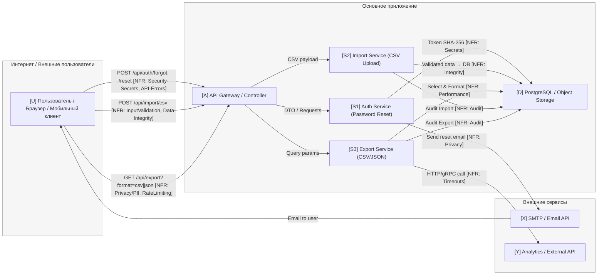

# TM - Требования безопасности + Модель угроз + ADR

---

## 0) Мета

- **Версия (commit/date):** 1 / 2025-10-12
- **Кратко (1-2 предложения):** Система с импортом/экспортом .csv файлов, и фунционалом разлогина

---

## 1) Архитектура и границы доверия (TM1, S04)

- **Роли/активы:** пользователь; ПДн/токены/данные в формате .csv
- **Зоны доверия:** Internet / DMZ / Internal 
- **Context/DFD:**

## 2) Реестр угроз STRIDE (TM2, TM3, S04)

| Element | Data/Boundary | Threat | Description | NFR link (ID) | Mitigation idea (ADR later) |
|----------|---------------|---------|-------------|---------------|------------------------------|
| Edge: U→A | Public API | S | Подмена токена авторизации при импорте/экспорте | NFR-013-7, NFR-014-5 | JWT TTL + подпись |
| Edge: U→A | File upload | T | Изменение CSV перед валидацией (инъекция формул) | NFR-013-1 | InputValidation + sanitize |
| Edge: U→A | Auth forms | S | Подмена email при запросе сброса пароля | NFR-003-6 | CAPTCHA + rate limit |
| Node: S1 Auth | Token | I | Утечка токена сброса в логах | NFR-003-4 | Маскирование токенов |
| Node: S2 Import | CSV file | I | Утечка PII в CSV при ошибке схемы | NFR-013-8 | PII check + reject |
| Node: S3 Export | Query result | I | Экспорт с PII без прав | NFR-014-1 | Role check + include_pii=false |
| Node: A | Controller | D | Массовые запросы (DoS) на импорт/экспорт | NFR-013-5, NFR-014-2 | RateLimit middleware |
| Edge: S2→D | SQL insert | T | Изменение записей при импорте | NFR-013-2 | Parameterized queries |
| Edge: S3→D | SQL select | I | Утечка tenant data | NFR-014-10 | Tenant isolation |
| Node: D | Database | R | Нет аудита операций импорта/экспорта | NFR-013-10, NFR-014-7 | Audit log on commit |
| Node: S3 | Business logic | E | Обход RBAC при экспорте | NFR-014-5 | Role check in query |
| Edge: S1→X | SMTP | D | Повторные письма при сбое | need NFR | Retry + CircuitBreaker |
| Edge: S3→Y | External API | D | Нет таймаутов, зависание | need NFR | Timeout ≤2s, retry ≤3 |
| Node: S2 | Job Worker | R | Нет логов фоновых задач импорта | NFR-013-3 | Correlation ID + jobId |
| Node: S1 | Audit | R | Нет записи о смене пароля | NFR-003-4 | Audit event |
| Node: A | Public API | I | Ошибки API раскрывают внутренние поля | NFR-013-6, NFR-014-4 | RFC7807 errors |
| Node: D | Storage | I | Хранение CSV без шифрования | need NFR | AES-256 at rest |
| Node: D | Storage | D | Переполнение хранилища большими CSV | NFR-013-1 | File size ≤10 MiB |
| Node: S3 | Performance | D | Долгие выгрузки блокируют сервер | NFR-014-3 | Async export job |
| Node: U | Client | S | Фишинговые ссылки сброса | NFR-003-2 | Signed HTTPS link |

---

## 3) Приоритизация и Top-5 _(TM3, S04)_

| Rank | Risk | Причина высокой оценки | ADR candidate |
|------|------|------------------------|---------------|
| 1 | R-04 | Вредоносный CSV (Tampering) — высокая вероятность и серьёзный ущерб | Schema + sanitize CSV |
| 2 | R-03 | Утечка персональных данных при экспорте — критичный ущерб приватности | Role-based filter PII |
| 3 | R-05 | Фишинговые письма сброса пароля — высокая частота и тяжёлые последствия | Signed HTTPS reset link |
| 4 | R-01 | Утечка токенов сброса в логах — прямая компрометация аккаунтов | Mask tokens in logs |
| 5 | R-02 | Массовые DoS-запросы — угроза доступности сервиса | Global RateLimit + Queue |

---

## 4) Требования (S03) и ADR-решения (S05) под Top-5 (TM4)

## US-003 — Password Reset

| ID | User Story / Feature | Category | Requirement (NFR) | Rationale / Risk | Acceptance (G-W-T) | Evidence (test/log/scan/policy) | Trace (issue/link) | Owner | Status | Priority | Severity | Tags |
| -- | -------------------- | -------- | ----------------- | ---------------- | ------------------ | ------------------------------- | ------------------ | ----- | ------ | ----------- | ---------- | ---- |
| NFR-003-1 | US-003 Password Reset | Security-Secrets | Токен сброса — ≥128 бит, TTL ≤15 мин, одноразовый, хранится в виде SHA-256 хэша | Предотвращение компрометации и повторного использования токена | **Given** пользователь запрашивает сброс  **When** создаётся токен  **Then** токен имеет ≥128-битную энтропию, действует ≤15 мин, одноразовый | unit: `token-entropy`; scan: secrets-storage | #US-003 | backend | Draft | P1 - High | S1 - Critical | security,secrets |
| NFR-003-2 | US-003 Password Reset | Privacy/PII | В письме отсутствуют персональные данные, только ссылка; email подтверждён | Минимизация утечки PII через почту | **Given** запрос на сброс  **When** письмо отправлено  **Then** нет логина, телефона, имени; только ссылка с токеном | e2e: `email-template-check` | #US-003 | backend | Draft | P2 - Medium | S2 - Major | privacy,pii |
| NFR-003-3 | US-003 Password Reset | API-Contract/Errors | `/api/auth/forgot` и `/api/auth/reset` возвращают ошибки в RFC7807; одинаковый ответ при неверном email | Исключение утечек о наличии пользователя | **Given** неверный email  **When** POST `/api/auth/forgot`  **Then** 200 с сообщением “If account exists…” | contract test; API schema | #US-003 | backend | Draft | P1 - High | S2 - Major | api,errors |
| NFR-003-4 | US-003 Password Reset | Auditability | Все попытки сброса логируются с `timestamp`, `ip`, `user_id/null`, `correlation_id` | Трассировка инцидентов безопасности | **Given** запрос на сброс  **When** операция завершается  **Then** в audit-логах запись с user_id/ip/time | SIEM rule; log sample | #US-003 | devops | Proposed | P2 - Medium | S3 - Minor | audit,logging |
| NFR-003-5 | US-003 Password Reset | Security-PasswordPolicy | Новый пароль ≥12 символов, ≥1 заглавная, ≥1 цифра, ≥1 спецсимвол; не совпадает с последними 3 | Повышение стойкости и предотвращение reuse | **Given** слабый пароль  **When** POST `/api/auth/reset`  **Then** 400 и описание нарушенной политики | e2e: `password-policy`; unit validator | #US-003 | backend | Draft | P1 - High | S2 - Major | password,security |
| NFR-003-6 | US-003 Password Reset | Security-RateLimiting | Не более 5 запросов на сброс/час с одного IP или email | Защита от перебора email и DoS | **Given** 6-й запрос за час  **When** POST `/api/auth/forgot`  **Then** 429 с Retry-After | e2e: `reset-limit-test`; logs | #US-003 | backend | Proposed | P2 - Medium | S2 - Major | ratelimit,security |
| NFR-003-7 | US-003 Password Reset | Observability/Logging | Все события сброса помечаются `correlation_id`, формат логов JSON | Обеспечение трассировки по запросу | **Given** X-Correlation-ID  **When** сброс выполняется  **Then** correlation_id сохраняется во всех логах | log grep по id | #US-003 | devops | Proposed | P3 - Low | S3 - Minor | observability |
| NFR-003-8 | US-003 Password Reset | Availability | `/api/auth/forgot` и `/api/auth/reset` доступны ≥99.5 % в месяц | Гарантия доступности функции восстановления | **Given** мониторинг uptime  **When** суммарный простой  **Then** ≤3.6 ч в месяц | uptime report; grafana | #US-003 | devops | Proposed | P2 - Medium | S2 - Major | availability,slo |
| NFR-003-9 | US-003 Password Reset | Usability | Ссылка в письме должна вести на форму сброса и работать ≥ 99 % случаев | Улучшение UX при восстановлении | **Given** полученное письмо  **When** пользователь кликает  **Then** страница открывается, токен валиден | UX-тест; QA-отчёт | #US-003 | frontend | Draft | P3 - Low | S3 - Minor | usability,ux |

---

## US-013 — Import CSV
| ID | User Story / Feature | Category | Requirement (NFR) | Rationale / Risk | Acceptance (G-W-T) | Evidence (test/log/scan/policy) | Trace (issue/link) | Owner | Status | Priority | Severity | Tags |
| -- | -------------------- | -------- | ----------------- | ---------------- | ------------------ | ------------------------------- | ------------------ | ----- | ------ | ----------- | ---------- | ---- |
| NFR-013-1 | US-013 Import CSV | Security-InputValidation | `POST /api/import/csv`: ≤10 MiB, MIME = `text/csv` или `application/csv`; лишние колонки → 400 | Защита от DoS/грязных данных | **Given** CSV 12 MiB или неверный MIME  **When** POST  **Then** 413 (RFC7807) | e2e: `import-size-check` | #US-013 | backend | Draft | P1-High | S2-Major | validation,limits |
| NFR-013-2 | US-013 Import CSV | Data-Integrity | Даты → UTC ISO-8601; строки → NFC; телефоны → E.164 | Предотвращение невалидных данных | **Given** разные форматы  **When** импорт  **Then** все данные нормализованы | unit: normalize-fields | #US-013 | backend | Draft | P2-Medium | S2-Major | integrity,data |
| NFR-013-3 | US-013 Import CSV | Observability/Logging | Все шаги импорта логируются в JSON с `jobId` и `correlation_id` | Трассировка фоновых джоб | **Given** X-Correlation-ID  **When** импорт выполнен  **Then** jobId в логах | log sample; trace | #US-013 | devops | Proposed | P2-Medium | S3-Minor | logging,observability |
| NFR-013-4 | US-013 Import CSV | Availability | `/health/ready` = 200 через ≤30 с после старта | Проверка готовности в CI/CD | **Given** контейнер запущен  **When** 30 с  **Then** `/health/ready` 200 | readiness probe | #US-013 | devops | Draft | P3-Low | S3-Minor | health,availability |
| NFR-013-5 | US-013 Import CSV | Scalability | При росте нагрузки ×2 P95 растёт ≤1.2×; 5xx ≤1 % | Масштабируемость и SLO | **Given** 20 RPS  **When** 40 RPS  **Then** P95 ≤ 1.2× базы | loadtest report | #US-013 | backend | Proposed | P1-High | S2-Major | scalability,slo |
| NFR-013-6 | US-013 Import CSV | API-Contract/Errors | Ошибки в RFC 7807, без stacktrace, с `correlation_id` | Единый формат ошибок | **Given** ошибка импорта  **When** ответ  **Then** формат RFC7807 | contract test | #US-013 | backend | Proposed | P2-Medium | S3-Minor | api,errors |
| NFR-013-7 | US-013 Import CSV | Security-AuthZ | Импорт доступен только роли `manager` или `admin`; остальные → 403 | Защита от несанкционированного импорта | **Given** роль viewer  **When** POST  **Then** 403 | e2e authz test | #US-013 | backend | Draft | P1-High | S2-Major | authz,security |
| NFR-013-8 | US-013 Import CSV | Privacy/PII | CSV не должен содержать PII (ИНН, телефон); проверка до импорта | Соответствие GDPR | **Given** CSV с PII  **When** загрузка  **Then** 400 и описание поля | validator policy | #US-013 | backend | Draft | P2-Medium | S2-Major | privacy,pii |
| NFR-013-9 | US-013 Import CSV | Performance | 1000 строк обрабатываются ≤ 2 с; 100 k строк ≤ 60 с | UX/SLO при массовом импорте | **Given** CSV 100 k  **When** импорт  **Then** ≤ 60 с | perf test | #US-013 | backend | Proposed | P2-Medium | S2-Major | performance |
| NFR-013-10 | US-013 Import CSV | Auditability | Каждая успешная операция импорта логируется в audit с пользователем и файлом | Контроль изменений данных | **Given** POST успешен  **When** просмотр audit  **Then** запись создана | audit log sample | #US-013 | devops | Proposed | P3-Low | S3-Minor | audit,logging |

---

## US-014 — Export CSV / JSON
| ID | User Story / Feature | Category | Requirement (NFR) | Rationale / Risk | Acceptance (G-W-T) | Evidence (test/log/scan/policy) | Trace (issue/link) | Owner | Status | Priority | Severity | Tags |
| -- | -------------------- | -------- | ----------------- | ---------------- | ------------------ | ------------------------------- | ------------------ | ----- | ------ | ----------- | ---------- | ---- |
| NFR-014-1 | US-014 Export CSV/JSON | Privacy/PII | Экспорт по умолчанию без PII; `include_pii=true` только для admin/manager; ретенция ≤ 7 дней | Защита данных и конфиденциальность | **Given** viewer  **When** `include_pii=true`  **Then** 403 | e2e privacy mask | #US-014 | backend | Draft | P1-High | S1-Critical | privacy,pii |
| NFR-014-2 | US-014 Export CSV/JSON | RateLimiting | ≤ 60 req/min на токен; 429 + `Retry-After` при превышении | Защита от злоупотреблений | **Given** 65 req  **When** 60 с  **Then** 429 | e2e ratelimit | #US-014 | backend | Draft | P2-Medium | S2-Major | limits |
| NFR-014-3 | US-014 Export CSV/JSON | Performance | При 50 RPS P95 ≤ 500 ms (JSON), ≤ 800 ms (CSV); ошибки ≤ 1 % | SLO/UX | **Given** нагрузка 50 RPS  **When** экспорт  **Then** время в норме | perf report | #US-014 | backend | Proposed | P1-High | S2-Major | performance,slo |
| NFR-014-4 | US-014 Export CSV/JSON | API-Contract/Errors | Ошибки в RFC 7807; `format=xml` → 400; нет auth → 401; нет прав → 403 | Единый контракт ошибок | **Given** `format=xml`  **When** GET  **Then** 400 RFC7807 | contract test | #US-014 | backend | Draft | P2-Medium | S3-Minor | api,errors |
| NFR-014-5 | US-014 Export CSV/JSON | Security-AuthZ | Экспорт доступен только владельцу или роли admin | Защита данных от утечек | **Given** чужой tenant  **When** GET  **Then** 403 | e2e authz | #US-014 | backend | Draft | P1-High | S2-Major | authz,security |
| NFR-014-6 | US-014 Export CSV/JSON | Scalability | 2× рост нагрузки → P95 ≤ 1.3×; ошибки ≤ 1 % | Масштабируемость API | **Given** база нагрузка  **When** ×2  **Then** P95 ≤ 1.3× | loadtest | #US-014 | backend | Proposed | P2-Medium | S2-Major | scalability |
| NFR-014-7 | US-014 Export CSV/JSON | Auditability | Каждый экспорт логируется с пользователем и фильтрами | Контроль доступа к данным | **Given** GET экспорт  **When** просмотр audit  **Then** запись есть | audit log | #US-014 | devops | Proposed | P3-Low | S3-Minor | audit,logging |
| NFR-014-8 | US-014 Export CSV/JSON | Observability/Tracing | Все экспорты имеют `correlation_id`; метрики по времени и объёму в Prometheus | Диагностика и метрики | **Given** экспорт  **When** выполнен  **Then** traceId в логах и метрики обновлены | log sample; metrics | #US-014 | devops | Proposed | P3-Low | S3-Minor | observability |
| NFR-014-9 | US-014 Export CSV/JSON | Availability | API экспорта ≥ 99.5 % uptime | Надёжность сервиса | **Given** мониторинг  **When** месяц  **Then** простой ≤ 3.6 ч | uptime report | #US-014 | devops | Proposed | P2-Medium | S2-Major | availability |
| NFR-014-10 | US-014 Export CSV/JSON | Data-Integrity | Экспортированные данные совпадают с БД (контроль хэша или checksum) | Целостность данных при экспорте | **Given** GET экспорт  **When** проверен хэш  **Then** совпадает | checksum test | #US-014 | backend | Draft | P2-Medium | S2-Major | integrity,data |

---

## 5) Принятые решения (ADR)
- **ADR (R‑04):** Валидация импорта и лимиты — шлюз: размер/MIME; S2: белый список схемы; нормализация; защита от CSV‑инъекций; RFC7807.
- **ADR (R‑03):** Ролевой фильтр PII при экспорте — `include_pii` только для админов/уполномоченных; маскирование; lifecycle S3 ≤30д; аудит; feature‑flag.
- **ADR (R‑05):** Подписанные HTTPS‑ссылки сброса + почтовые политики — HMAC‑подпись, TTL ≤15м, одноразово; DMARC/SPF/DKIM(+BIMI); rate‑limit /forgot; HSTS; без внешних редиректов.

## 6) Трассировка Threat → NFR → ADR → Тесты
| Threat/Risk | NFR | ADR/Политика | Evidence/Тесты |
|---|---|---|---|
| CSV tampering (R‑04) | NFR‑013‑1/2 | ADR R‑04 | e2e: `import-size-check`, `schema-extra-cols`; unit: `normalize-fields`, `sanitize-formulas` |
| PII export leak (R‑03) | NFR‑014‑1 | ADR R‑03 | e2e: `export_pii_access_test`; unit: `mask_pii_fields`; lifecycle policy |
| Phishing reset (R‑05) | NFR‑003‑1/2/6 | ADR R‑05 | e2e: `email-template-check`, `reset-limit-test`; unit: `token-hmac-verify` |
| Tokens in logs (R‑01) | NFR‑003‑4/7 | Политика mask/strip | Лог‑скан по сигнатурам секретов; JSON‑структура |
| DoS import/export (R‑02) | NFR‑013‑5, NFR‑014‑2 | Rate‑limit + Queue | Нагрузочные тесты; 429 + Retry‑After |

## 7) Тестирование, наблюдаемость, соответствие
- **Контракт ошибок:** RFC7807 с `correlation_id` во всех сервисах.
- **Аудит:** события импорта/экспорта/сброса, правила SIEM для аномалий.
- **Приватность:** экспорт без PII по умолчанию; маскирование; короткий retention.
- **Доступность/SLO:** ≥99.5% для критичных путей (reset/export); целевые perf‑SLO.
- **Почта:** SPF/DKIM/DMARC (p=reject), опц. BIMI.
- **Метрики:** таймеры и счётчики отказов/отбрасываний; дэшборды.

## 8) Открытые вопросы
- Политика обработки ячеек, похожих на формулы: экранировать vs. отклонять файл при порогах.
- Детализация маскировки по полям (пример: телефоны — последние 4 цифры).
- Применение lifecycle к выгрузкам внешней аналитики.
- Коды для просроченных/повторно использованных токенов (410 vs 409).

## 9) Приложения (артефакты)
- DFD — `S04_dfd.md`
- STRIDE‑матрица — `S04_stride_matrix.md`
- Оценка рисков — `S04_risk_scoring.md`
- Реестр NFR — `S03_register.md`
- ADR и Option‑матрицы — `S05_*`
